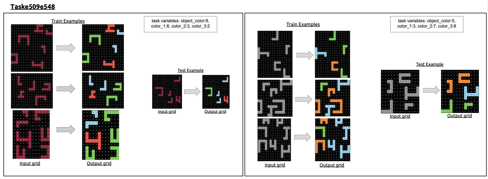

<div align="center">
  
  <h1>ARC-TGI: ARC Task Generators Inventory</h1>
  <p><em>A project for writing generators for Abstraction and Reasoning Corpus (ARC) tasks.</em></p>
</div>

<!-- <hr> -->

## Example Output

<div align="center">
  
  <p><em>Generated ARC-TGI examples illustrating within-family variation for the original ARC task. 
The tasks are sampled from the same generator and share the same latent transformation rule, while differing in nuisance instantiations. 
Within each generated sample, task variables such as object colors remain consistent between the input and output grids, whereas object positions, sizes, number of objects, and grid sizes vary across training and test examples. 
Across samples within the same family, the colors of the objects in the input grids and their corresponding colors in the output grids vary, while the task remains solvable from the provided training examples.</em></p>
</div>

## Generators

The `Generators/` directory contains three main subfolders: **ARC-AGI-1**, **ARC-AGI-2**, and **ARC-Mini**.

**ARC-AGI-1** contains our ARC-TGI generators constructed for tasks from the ARC-AGI-1 benchmark (https://arcprize.org/arc-agi/1/). Each generator preserves the latent transformation logic and task-level generalization properties of the original ARC-AGI-1 tasks while allowing systematic variation in object configurations, layouts, and grid properties.

**ARC-AGI-2** contains our ARC-TGI generators constructed for tasks from the ARC-AGI-2 benchmark (https://arcprize.org/arc-agi/2/). Each generator preserves the latent transformation logic and task-level generalization properties of the original ARC-AGI-2 tasks while allowing systematic variation in object configurations, layouts, and grid properties.

**ARC-Mini** contains simplified generators created by us to model elementary ARC-style reasoning patterns. In ARC-Mini, each task is designed around a single core transformation rule, enabling controlled experiments and analysis of fundamental reasoning primitives.

## Prerequisites

- Python 3.12 or higher

## Installation

1. Clone the repository:
```bash
git clone https://github.com/Omega-Reasoning/ARC-Task-Generators.git
cd ARC-Task-Generators
```

2. Create and activate a virtual environment:
```bash
# On Windows
python -m venv venv
.\venv\Scripts\activate

# On macOS/Linux
python -m venv venv
source venv/bin/activate
```

3. Install dependencies:
```bash
pip install -r requirements.txt
```

## Use generators

You have three options to use the generators described below:
* test them in a Streamlit app (Framework/app.py)
* run a single generator via commandline (Framework/test.py)
* create a full dataset (Framework/dataset_generator.py) 

### Streamlit

Run the Streamlit app to interactively test and visualize task generators:
```bash
streamlit run Framework/app.py
```

This allows you to select a generator, create new tasks, and view the output.

### Command line

#### Generate an ARC task 
```bash
python -m Framework.test  Generators/ARC-AGI-1/Train/task0b148d64.py 
```

#### Generate and visualize a task
```bash
python -m Framework.test  Generators/ARC-AGI-1/Train/task0b148d64.py  -v
```

### Dataset generator

Use the dataset generator to create a dataset of ARC tasks from multiple generators:

```bash
python -m Framework.dataset_generator [options]
```

#### Options:
- `-g, --generator_folders`: Specify one or more folders containing generators
  - Default: All non-hidden subfolders inside `Generators/`
  - Example: `python -m Framework.dataset_generator -g Generators/ARC-AGI-1/Train  Generators/ARC-AGI-1/Eval`

- `-f, --generator_files`: Specify individual generator files to use
  - Example: `python -m Framework.dataset_generator -f path/to/generator1.py path/to/generator2.py`

- `-n, --nr_of_tasks`: Number of tasks to generate per generator
  - Default: 100
  - Example: `python -m Framework.dataset_generator -n 50`

- `-o, --output`: Output directory for generated datasets
  - Default: "datasets"
  - Example: `python -m Framework.dataset_generator -o my_datasets`

#### Examples:

Generate default number of tasks from all generators:
```bash
python -m Framework.dataset_generator
```

Generate 50 tasks from specific folders:
```bash
python -m Framework.dataset_generator -g Generators/ARC-AGI-1/Train  Generators/ARC-AGI-1/Eval -n 50
```

Generate tasks from specific generator files:
```bash
python -m Framework.dataset_generator -f Generators/ARC-AGI-1/Train/task0b148d64.py  Generators/ARC-AGI-1/Eval/task1a2e2828.py 
```

Generate tasks from both folders and individual files:
```bash
python -m Framework.dataset_generator -g Generators/ARC-AGI-1/Train -f  Generators/ARC-AGI-1/Eval/task1a2e2828.py -n 100
```

Generate tasks with custom output location:
```bash
python -m Framework.dataset_generator -o custom_datasets -n 200
```

The generator creates both individual CSV files for each folder and a combined 'all.csv' file in the output directory. Individual generator files are saved to an 'individual_files.csv' file.
