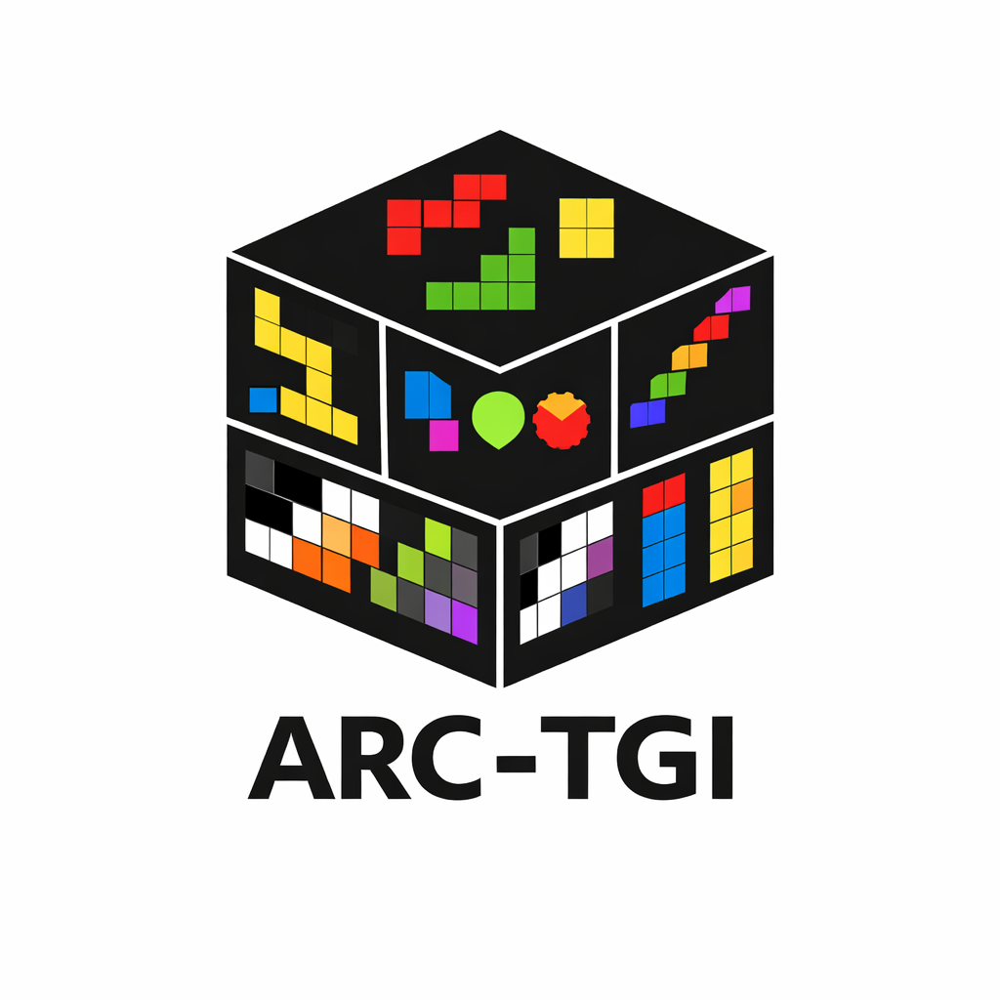

<div align="center">
  
  <h1>ARC-TGI: ARC Task Generators Inventory</h1>
  <p><em>A project for writing generators for Abstraction and Reasoning Corpus (ARC) tasks.</em></p>
</div>

<!-- <hr> -->

## Prerequisites

- Python 3.12 or higher

## Installation

1. Clone the repository:
```bash
git clone https://github.com/Omega-Reasoning/ARC-Task-Generators.git
cd ARC-Task-Generators
```

2. Create and activate a virtual environment:
```bash
# On Windows
python -m venv venv
.\venv\Scripts\activate

# On macOS/Linux
python -m venv venv
source venv/bin/activate
```

3. Install dependencies:
```bash
pip install -r requirements.txt
```

## Use generators

You have three options to use the generators described below:
* test them in a Streamlit app (app.py)
* run a single generator via commandline (test.py)
* create a full dataset (dataset_generator.py) 

### Streamlit

Run the Streamlit app to interactively test and visualize task generators:
```bash
streamlit run app.py
```

This allows you to select a generator, create new tasks using and view the output.

### Command line

#### Generate an ARC task 
```bash
python test.py arc_training/task007bbfb7.py 
```

#### Generate and visualize a task
```bash
python test.py arc_training/task007bbfb7.py -v
```

### Dataset generator

Use the dataset generator to create a dataset of ARC tasks from multiple generators:

```bash
python dataset_generator.py [options]
```

#### Options:
- `-g, --generator_folders`: Specify one or more folders containing generators
  - Default: All non-hidden subfolders (except 'datasets')
  - Example: `python dataset_generator.py -g arc_training arc_test`

- `-f, --generator_files`: Specify individual generator files to use
  - Example: `python dataset_generator.py -f path/to/generator1.py path/to/generator2.py`

- `-n, --nr_of_tasks`: Number of tasks to generate per generator
  - Default: 100
  - Example: `python dataset_generator.py -n 50`

- `-o, --output`: Output directory for generated datasets
  - Default: "datasets"
  - Example: `python dataset_generator.py -o my_datasets`

#### Examples:

Generate default number of tasks from all generators:
```bash
python dataset_generator.py
```

Generate 50 tasks from specific folders:
```bash
python dataset_generator.py -g arc_training arc_test -n 50
```

Generate tasks from specific generator files:
```bash
python dataset_generator.py -f arc_training/task007bbfb7.py arc_test/task123abc4.py
```

Generate tasks from both folders and individual files:
```bash
python dataset_generator.py -g arc_training -f custom_generators/special_task.py -n 100
```

Generate tasks with custom output location:
```bash
python dataset_generator.py -o custom_datasets -n 200
```

The generator creates both individual CSV files for each folder and a combined 'all.csv' file in the output directory. Individual generator files are saved to an 'individual_files.csv' file.
